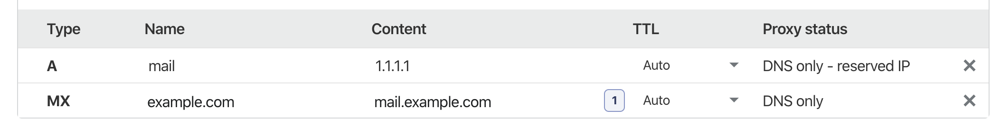

# Setup Mega Account docker!
____
For all email related stuff this container extends https://github.com/tomav/docker-mailserver which is definitely a bit overkill but why reinvent the wheel...
____

1. Get a domain:
    - I recomend using [freenom.com](https://www.freenom.com/en/index.html?lang=en) mainly because it is _free_ and the only people to see it will be mega.nz.

2. Create .env with domain name
```
DOMAINNAME=example.com
OVERRIDE_HOSTNAME=mail.example.com
CREDENTIALS=*somelongstring*
```

3. set `OVERRIDE_HOSTNAME=` in `env-mailserver` to `mail.example.com`


4. Add DNS records (replacing `1.1.1.1` with your public IP and `example.com` with your domain from freenom):



5. To allow mega account generation add a ssh public key, which can be found by running `docker exec -it mega-backup cat /root/.ssh/id_rsa.pub` on the host(s) where you are running the [mega-backup](https://github.com/maxisme/mega-backup) to `.ssh/authorized_keys`.

6. Start `docker-compose up -d`

7. Create new account and send an email to it.